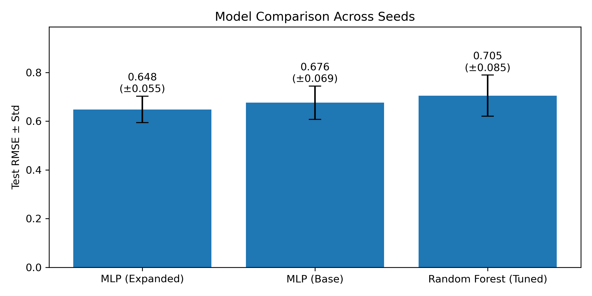
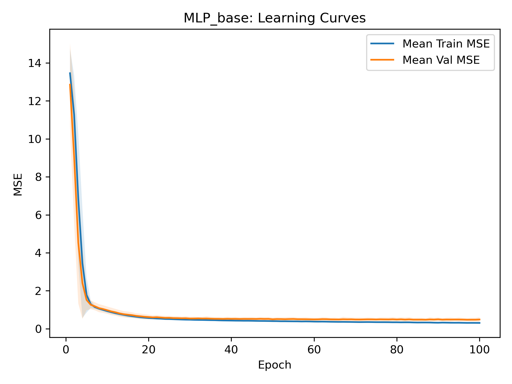
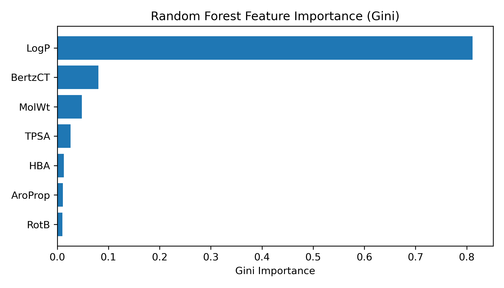
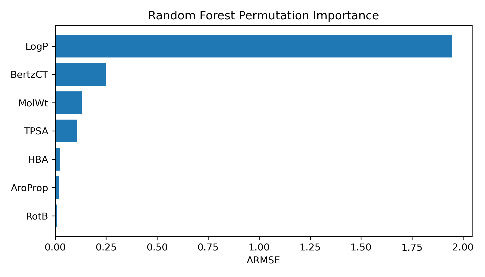
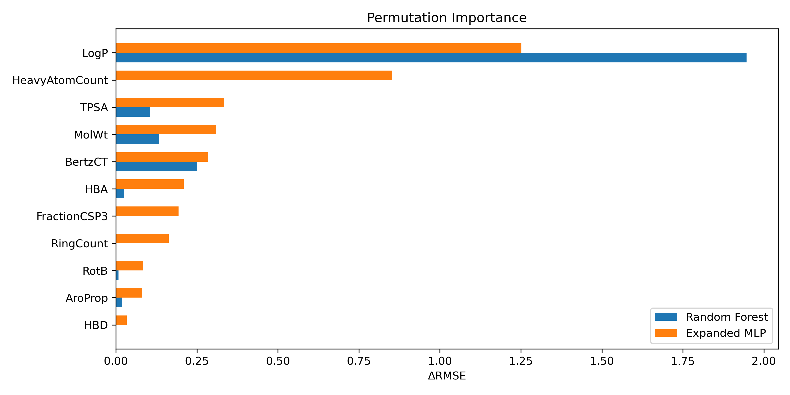
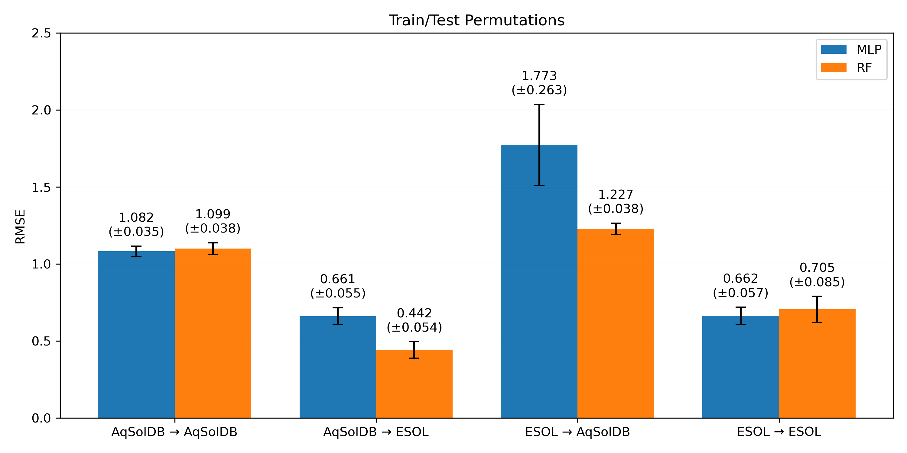

# SolPredict: Summary & Analysis

## 1. Background & Summary

Aqueous solubility plays a central role in drug discovery, affecting absorption, distribution, and formulation decisions. Experimentally measuring solubility is costly and time-consuming, motivating the use of computational models to estimate compound solubility.

Machine learning approaches to solubility prediction rely on molecular descriptors that encode size, polarity, lipophilicity, functional group composition, and more. Classical models such as Random Forests are well-suited for tabular descriptor data and often serve as strong baselines. Neural networks, while more sensitive to hyperparameters, offer increased representational capacity and may better capture nonlinear interactions among descriptors. 

In this project, I developed, tuned, and compared machine learning models for predicting aqueous solubility (`logS`) from molecular descriptors using the Delaney ESOL dataset, with an emphasis on fair model comparison, stability across random seeds, and chemical interpretability analysis.

Three main models were tuned and evaluated: a Random Forest via `scikit-learn` with a baseline descriptor-set, a multilayer perceptron (MLP) via `PyTorch` using the same base descriptor-set, and an MLP using an expanded descriptor-set. Across 25 random-seed trials, the expanded MLP achieved both the lowest mean RMSE and the lowest variance, indicating superior generalization and training stability. While the Random Forest occasionally produced strong individual predictions, its performance was less stable across seeds.

Primary model development was performed on the Delaney ESOL dataset, with AqSolDB used only for downstream generalization analysis.

### 1.1 Key Takeaways

- Neural networks materially outperform Random Forests under a matched evaluation protocol for this task
- Expanding the descriptor set improves stability more so than peak performance
- Performance differences are larger than expected seed-level noise, supporting meaningful model comparisons

This project is exploratory in nature and prioritizes methodological logic, learning, and analysis over research-grade reproducibility, and results should be interpreted as such.

### 1.2 Repository structure

- `wk*/`: exploratory scripts, data, and figures. Represents a rough categorization of the project into weeks of work
- `exports/`: data & figures for final use

## 2. Data & Experimental Setup

### 2.1 Dataset

Models were trained on the Delaney ESOL dataset (`n = ~1100` compounds), with the target variable defined as `logS` (logarithm of aqueous solubility). Dataset preprocessing was kept minimal to avoid unnecessary complications or introducing additional assumptions.

### 2.2 Train/Validation/Test Splits

Data were split into training, validation, and test sets using a fixed 80/10/10 split. The same split was reused across all models to ensure comparability (RF trained on the 80/10 train-validation segment, so all testing was done against the same remaining 10 for each model).

### 2.3 Evaluation Metrics

Root Mean Squared Error (RMSE) was used as the primary evaluation metric, with R² reported as a secondary diagnostic. Tuned hyperparameters were determined based on minimum RMSE, keeping the train/validation/test split consistent throughout. To assess robustness, each final model configuration was evaluated across 25 random seeds. Final performance is reported as the mean and standard deviation of test RMSE across seeds, rather than relying on a single run.

## 3. Features & Models

### 3.1 Descriptors

Two sets of descriptors were used in the final models:
1. **Base**: comprised of seven descriptors capturing size, polarity, complexity, aromaticity, and lipophilicity.
2. **Expanded**: comprised of eleven total descriptors (four on top of the base descriptors) intended to provide richer chemical signal for the NN model.

### 3.2 Models

1. **Random Forest**: The Random Forest model serves as a strong baseline for tabular chemical data. It is less sensitive to feature scaling and can capture nonlinear effects, but struggles to extrapolate smoothly across a wider chemical space. 
    
    Tuned Hyperparameters: `max_depth = 20`, `min_samples_leaf = 2`, `min_samples_split = 2`, `n_estimators = 200`.

2. **Base MLP**: A neural network trained on the base descriptor set using an Adam optimizer. 
    
    Tuned Hyperparameters: `hidden_sizes = (64, 32, 16, 8)`, `dropout_p = 0.0`, `learning_rate = 2e-3`, `weight_decay = 1e-3`
    
3. **Expanded MLP**: Trained on the expanded descriptor set. Tests whether additional feature information improves learning stability and generalization.

    Tuned Hyperparameters: `hidden_sizes = (256, 128)`, `dropout_p = 0.1`, `learning_rate = 2e-3`, `weight_decay = 1e-5`

## 5. Results

### 5.1 Seed-Tested Performance

Across repeated seed evaluations, the expanded-descriptor MLP achieved the lowest mean RMSE and lowest standard deviation, indicating both improved accuracy and consistency. The base MLP outperformed the Random Forest on average, suggesting that even modest neural architectures can be competitive when properly tuned.

| Model | Features | Mean RMSE | RMSE STD |
|-------|----------|------|------|
| Tuned Random Forest | base | 0.705 | 0.085 |
| Base MLP | base | 0.676 | 0.069 |
| Expanded MLP | expanded | 0.648 | 0.055 |

### 5.2 Residual and Error Analysis

Residual distributions for all models were approximately centered around zero, indicating low systematic bias. However, the expanded MLP showed tighter clustering and shorter tails, consistent with its lower RMSE variance. Error analysis suggests that descriptor expansion improves robustness rather than simply optimizing best-case performance.

### 5.3 MLP Learning Behavior

Learning curves for the neural networks showed stable convergence. The expanded-descriptor MLP exhibited smoother validation loss trajectories, suggesting improved signaling during training, but also appears to have mild overfitting.

## 6. Basic Model Interpretation

### Random Forest

Gini-based and permutation analysis identified `logP`, a metric for lipophilicity, as by far the greatest predictor for solubility. `BertzCT`, a proxy for molecular complexity, `MolWt`, and `TPSA` (total polar surface area) followed.

### MLP Models

Permutation analysis for the expanded MLP model revealed somewhat overlapping but different importance patterns compared to the Random Forest. The expanded MLP appeared to distribute importance across a broader set of descriptors, consistent with its improved stability. As with the Random Forest, these findings reflect model sensitivity rather than mechanistic insight.

## 7. Cross-Dataset Generalization

As a final step, a train/test matrix was used with the Delaney ESOL dataset, the baseline, and the AqSolDB dataset, a new addition. AqSolDB contains `9655` datapoints to Delaney's `1144` and spans a substantially wider range of logS values, whereas ESOL is smaller and more narrowly distributed.

When trained and tested on the same dataset, the same pattern of the expanded MLP slightly but consistently outperforming the RF prevails. Performance is notably better on ESOL → ESOL, reflecting the dataset’s narrower `logS` range and reduced chemical diversity, which seems to make the prediction task intrinsically easier.

Training on the larger AqSolDB dataset and testing on ESOL yields the lowest RMSE throughout the project (for RF, `0.442`), indicating that the broader coverage in AqSolDB enables the models to better generalize. In contrast, training on ESOL and testing on AqSolDB produces the worst performance, particularly for the MLP, consistent with a severe domain mismatch.

The Random Forest exhibits lower RMSE and variance under domain shift. This suggests that the neural network is more sensitive to dataset mismatch, whereas the Random Forest is primarily affected by the breadth of the training coverage.

Overall, these results emphasize that dataset size and target range have great effects on cross-dataset performance, often more than model choice itself, and reinforce the importance of training on diverse data to boost generalization performance.

## 8. Limitations

- There is not pipeline-level reproducibility via a single execution command. This reflects a prioritization of learning over polished, research-grade work.
- Descriptor-based models cannot fully capture structural nuances; molecular graphs and a GNN implementation would likely improve model performance, but this falls outside the scope of this project.
- Hyperparameter tuning was based only on the Delaney ESOL performance, so the "optimal" hyperparameters may not be optimal for other datasets.
- Random splits were used rather than scaffold-based splits, which may overestimate performance under structural shift.

## 9. Conclusion

This project demonstrates that, under fair evaluation, neural networks can outperform classical ensemble models for aqueous solubility prediction when provided with sufficiently rich descriptor information. Importantly, descriptor expansion also improved training stability and consistency.

Beyond specific performance metrics, the project highlights the value of stability testing and basic interpretability in applied machine learning for chemistry. The resulting framework provides a foundation for more advanced modeling approaches, including graph-based representations and uncertainty-aware predictions, in future work.

## 10. Future Work

### Extensions of SolPredict
- Implement richer molecular representations (GNNs) and assess model performance
- Implement better uncertainty measures and track apples-to-apples through model tuning and development
- Re-tune hyperparameters using the AqSolDB (wider) dataset to improve MLP performance
- Test on other datasets
- Develop deeper, chemically grounded interpretation analyses where aligned with available descriptors and targets.

### Goals:
- Build fully reproducible pipelines and transition from exploratory to research-grade coding structure
- Extend the modeling and evaluation framework to other domains (e.g., financial or biological data)
- Benchmark performance against existing models