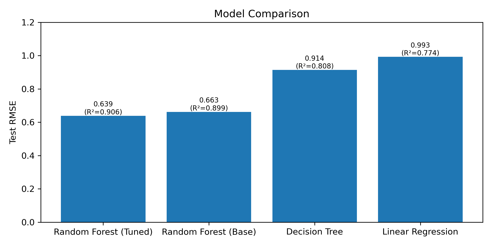

# SolPredict

Predicting aqueous solubility (logS) of organic compounds from molecular descriptors using machine learning.

## Summary

This project builds and compares machine learning models (Random Forest, PyTorch MLP) trained on molecular descriptors to predict aqueous solubility. Key deliverables include performance metrics, visualization figures, and interpretability analyses.

The project serves as an introduction to data-driven chemical engineering workflows — combining Python, machine learning, data science, and chemical intrepretation.

## Results Overview

| Model | Features | RMSE | RMSE STD |
|-------|----------|------|------|
| Linear Regression | base | 0.993 | NA |
| Decision Tree | base | 0.914 | NA |
| Tuned Random Forest | tuned | 0.705 | 0.085 |
| Base MLP | tuned | 0.676 | 0.069 |
| Expanded MLP | expanded | 0.648 | 0.055 |

## Figures

### Final Models 25-Seed Comparison

### Model Generalization (New Dataset Train/Test Permutations)

### Final Models Residual Histogram

### Early Single-Seed Model Comparison

## Key Resources

**[Delaney's ESOL Dataset](https://www.kaggle.com/datasets/yeonseokcho/delaney)**: Used throughout the project as the primary dataset

**[StatQuest Random Forest Overview](https://youtube.com/playlist?list=PLblh5JKOoLUIE96dI3U7oxHaCAbZgfhHk&si=GLTIecLnPPJ7IChQ)**

**[3Blue1Brown Neural Networks Overview](https://youtube.com/playlist?list=PLZHQObOWTQDNU6R1_67000Dx_ZCJB-3pi&si=Nd7eNZdtIJDM7Fm3)**

**[AqSolDB Dataset](https://www.kaggle.com/datasets/sorkun/aqsoldb-a-curated-aqueous-solubility-dataset)**: Used near the end of the project as a test for generalization capability and model limitations

## Goals
- Develop ML models that predict solubility from structural features  
- Compare the performance of multiple models 
- Familiarize self with accepeted research procedures
    - This project is exploratory, and is not of research-grade quality
    - Future projects will implement full reproducibility and less repetition (model initialization)
- Familiarize self with long-term, self-guided projects
- Troubleshoot coding and process roadblocks
- Prepare self for future projects involving interdisciplinary applications of ML and data science