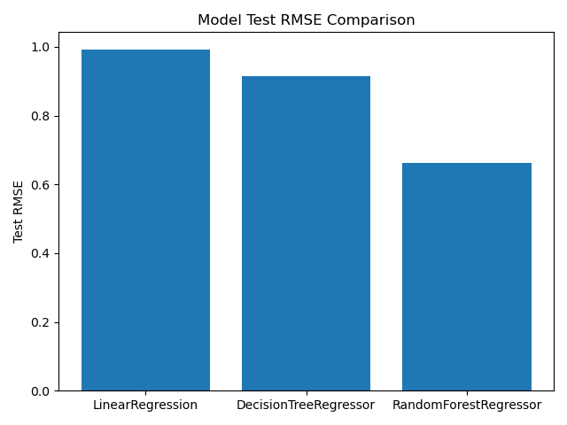
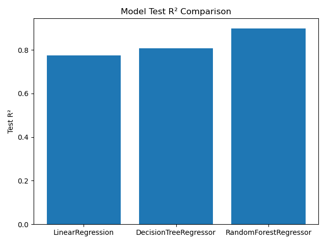

# SolPredict — Week 3 Solubility Modeling Report

## Objective

The overall objective of this project is to assess the efficacy of different machine learning models in predicting aqueous solubility based on molecular descriptors. This week's cumulative work represents the first step of that process, utilizing basic models to establish a  baseline before fine-tuning with more advanced models.

## Dataset & Features

This week's analysis utilizes the **Delaney (ESOL) Solubility Dataset**, which gives experimental logS values for various small organic molecules. Prior to preprocessing, the dataset contained 1144 unique molecules. RDKit molecule objects were generated from included SMILES identifications.

Each molecule is analyzed based on the following RDKit-generated molecular descriptors:
- Molecular weight (MolWt)
- LogP (octanol–water partition coefficient)
- Topological polar surface area (TPSA)
- Number of rotatable bonds (RotB)
- Aromatic proportion (AroProp)

These descriptors were selected because they are known to be correlated with solubility and are easily obtained via the RDKit library.
Invalid SMILES were removed prior to modeling. The final processed dataset was frozen into a single CSV file to ensure reproducibility across models.

## Models Tested

Three regression models were evaluated:
1. **Linear Regression**
    - Serves as the most basic baseline model, assumes fully linear relationships.
2. **Decision Tree Regressor**
    - Captures nonlinear relationships and molecular descriptor interactions.
    - Tree depth limited to limit the impact of overfitting.
3. **Random Forest Regressor**
    - Ensemble of decision trees to improve generalization.
    - Incorporates bagging and feature randomness to reduce variance.

All models were trained on the same 80/20 train–test split using a fixed random seed.

## Model Performance

RMSE captures absolute prediction error in logS units, while R² explains overall variance.

## Discussion

Linear regression performed adequately (RMSE = 0.993, R² = 0.774) but was significantly limited by its full assumption of linearity. 
Decision trees improved performance (RMSE = 0.914, R² = 0.808) but showed major signs of overfitting as evidenced by strong training subset performance relative to test set performance.
Random forest regression outperformed both (RMSE = 0.663, R² = 0.899) by abandoning the assumption of linearity and better incorporating the descriptor relationships via aggregating many decision trees (n_estimators = 200). This nonlinearity is especially important to chemical datasets, where relationships are rarely simple or linear.

The trade-off between linear regression and random forests is interpretability -- whereas linear regression always has clear, interpretable coefficients, random forest models require feature importance analysis to draw final conclusions.

## Key Takeaways

- Nonlinear models substantially improve solubility prediction accuracy.
- Ensemble methods offer better generalization than single-tree models.
- Freezing features early enables one-to-one, reproducible model comparisons.
- Even simple molecular descriptors can contain meaningful insight and can establish a baseline for predictive modeling.

## Next Steps

Planned improvements:
 - Hyperparameter tuning (e.g. tree depth, minimum samples per leaf, ensemble size) to improve generalization performance
 - K-fold partitioning to better assess generalization performance of various models
 - Incorporating/swapping molecular descriptors (e.g. hydrogen bond donors/acceptors, ring counts, molecular complexity indices)
 - Uncertainty estimation to better identify models' effective domains