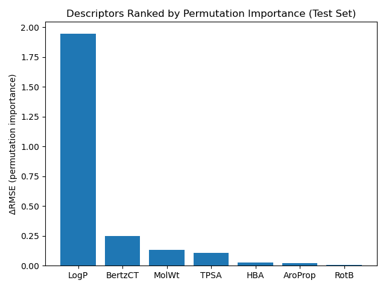
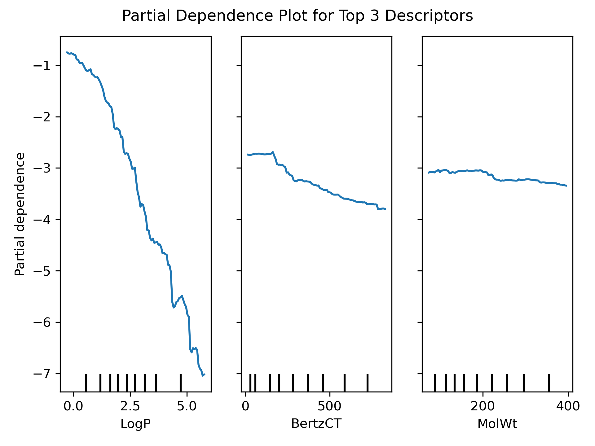

# Importance & Dependence Analysis on Final RF Model

## Gini vs. Permutation Importance Comparison

The identical ranking between the two methods, with logP being by far the most influential descriptor, continues to suggest that hydrophobicity is the primary indicator for solubility in this dataset, with molecular complexity, size, and polarity being runners-up.

No evidence of bias in the random forest from tree-splitting or correlation appears from this analysis, and behavior across shuffles appears negligible, with small permutation standard deviations for relative to each descriptor's importance value.

## Permutation Importance via RMSE

As also indicated by Gini importance, permutation analysis shows that logP is by far the primary driver for estimating aqueous solubility, followed by Bertz Connectedness Index as a proxy for molecular complexity and molecular weight.

## Partial Dependence Plot

Partial dependence on logP shows a strong, nonlinear relationship -- aqueous solubility decreases monotonically as logP increases. The decline is moderate at low logP but becomes much steeper beyond logP ~ 2, suggesting that the RF model predicts highly lipophilic molecules as disproportionately less soluble.

Partial dependence on BertzCT displays a modest but consistent decrease in predicted solubility as complexity increases. This suggests that, after controlling for other descriptors, more complex molecules are predicted to be moderately less soluble.

Partial dependence on molecular weight exhibits a mild downward trend in predicted solubility for heavier molecules. The most visible decline occurs at a molecular weight of ~210amu, where logS decreases by roughly 0.2. However, no strong claim is able to be made about this decline; it is still modest, especially compared to partial dependence on logP.

As before, these findings are consistent with chemical intuition, hydrophobicity via logP acting as by far the most significant single descriptor for aqueous solubility.

## Next Steps

- Compile a concise metrics table for the final Random Forest model as determined by this week's tests
- Plot error distributions and residuals stratified by the top three predictors (logP, BertzCT, MolWt) to confirm that there are no systematic errors
- Assemble and visualize comparison figures using Tableau:
    - initial models vs. tuned RF
    - descriptor importance panel (Gini- & permutation-based)
    - cleaned partial dependence plot for logP, BertzCT, and MolWt (not in Tableau)
    - case study on one molecule from the dataset used
- **PyTorch Implementation** -- teach self basics, then create a regressor on the same descriptors to compare model performance