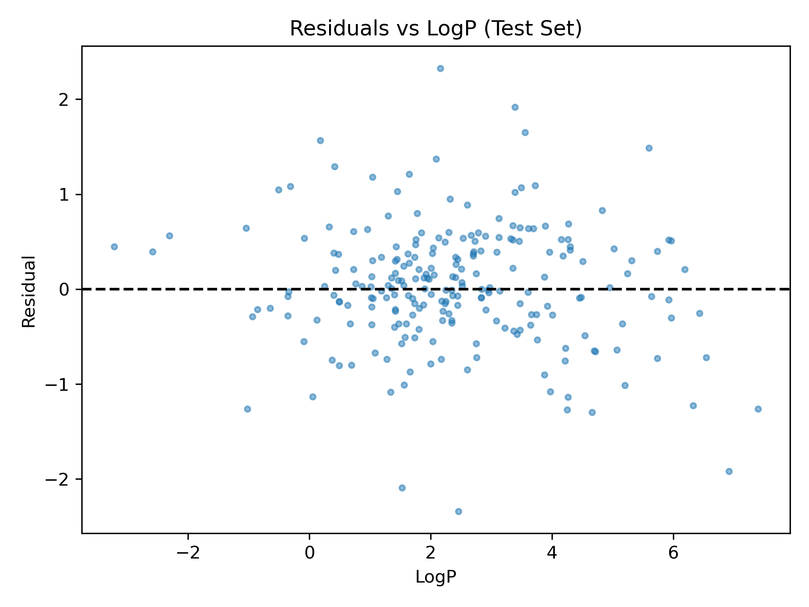
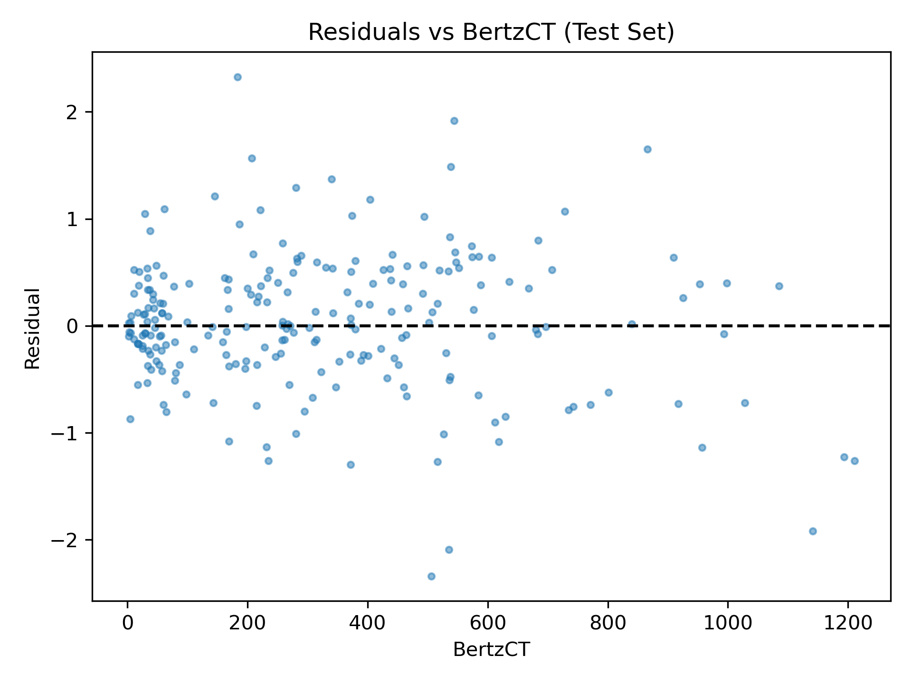

# Residual Diagnostic Summary

## Trends in Residuals

### No obvious trends appear.

Residual distribution appears to be approximately centered at 0.

No pattern appears in the residual vs. predicted logS plot.

No pattern appears in the residual vs. logP plot. A faint funnel-shape is present in the residual vs. BertzCT and residual vs. MolWt plot, but this does not indicate a systematic error as correlations are -0.0926 and -0.0678 respectively, as shown in **residuals_feature_correlation.csv**. 

These plots are a positive indicator that the model has little to no systematic error by exhibiting residual randomness and very low correlation with all 3 central descriptors.