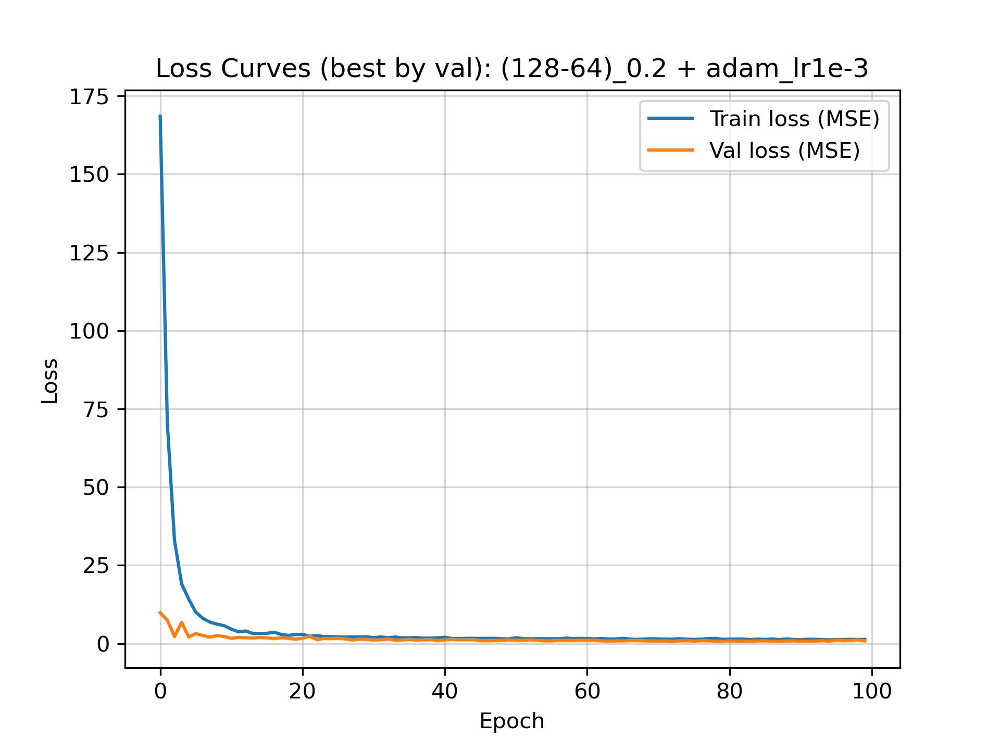

# Comparison Between Baseline PyTorch MLP & Tuned RF

## PyTorch Implementation

This stage introduces a minimalist implementation of neural networks in PyTorch using same features and seed as the RF model with an added validation split (80/20 for RF vs. 80/10/10 for MLP) so that changes in performance are attributable to model type rather than setup.

## MLP Setup

### Data

`wk4/final_descriptors.csv`

### Model Configuration

`seed` = 42
80/10/10 train/test/validation split (**change** from RF)

Evaluated by `MSE` loss during training, then by `RMSE` to compare with RF

### Model Operation

Descriptor matrices are converted into tensors. A SolubilityDataset subclass of PyTorch's built-in Dataset class is used to allow DataLoader to batch and shuffle. A no-grad setup is used for validation and test phases to reduce computational burden. 

The neural network works as follows with tensor-converted descriptor input:

- **Input**: Descriptor vector of length `n_features = 7`
- **Hidden Layers**: 2–3 hidden layers depending on configuration
- **Activations**: ReLU between linear layers
- **Regularization**: Dropout applied after each hidden layer
- **Output**: A final linear layer with output dimension 1, predicting logS

### Fixed Training Hyperparameters

- **Loss function**: `nn.MSELoss()`
- **Optimizer**: Adam
- **Epochs**: `num_epochs = 100`
- **Batch size**: `batch_size = 64`
- **Weight decay**: `weight_decay = 1e-4`

## Hyperparameter Sweep

The goal of the sweep was to assess whether adjusting NN capacity (depth & width), dropout rate, or learning rate materially affected performance on the MLP based directly off of RF setup.

**Hidden Layers**
- (64, 32)
- (128, 64)
- (64, 32, 16)

**Dropout Rate**
- 0.2
- 0.4

**Optimizer Learning Rate**
- 1e-3
- 5e-4

This grid is intentionally small, it was intended only to survey a small array of MLP configurations for the data.

### Selection

Each configuration was trained for 100 epochs, and the epoch with the lowest validation MSE was selected as the best instance. The best epochs' MSEs across models were compared, and one best model was chosen: `(128-64)_0.2,adam_lr1e-3`

- `hidden_size = (128, 64)`
- `dropout_p = 0.2`
- Adam `learning_rate = 1e-3`

The final report uses test set RMSE from this model, which was loaded into a fresh model instance.

### Best Model Analysis

Optimization appears to be stable and effective after ~20 epochs. After this point the training and validation curves track approximately, indicating little to no overfitting.

## Key Takeaways

`rf_test_rmse = 0.639` vs. 
`mlp_test_rmse = 0.885`

At this point, the MLP is significantly outperformed by the tuned RF model. However, because the MLP generalizes well without overfitting and train/validation splits converge early, it may benefit from re-adding descriptors to better predict logS. 

The RF, beyond it already being hyperparameter tuned, also tends to perform well with tabular data which may have sharp thresholds in descriptors to determine solubility behavior or contain interrelated descriptor information.

### Limitations of MLP

- Single seed validation (need to quantify variances across splits by changing seed)
- No descriptor scaling applied, which disadvantages MLPs compared to RFs

## Next Steps

- Lock the best hyperparameter combination from sweep, `(128-64)_0.2,adam_lr1e-3`, for reproducible training and validation
- Repeat training across seeds and determine RMSE standard deviation to assess stability (with `seed = 42` still used for comparisons)
- Test MLP performance with more descriptors (revert back to `wk4/expanded_descriptors.csv` and assess performance; add additional descriptors or molecular fingerprint metrics if results are promising)