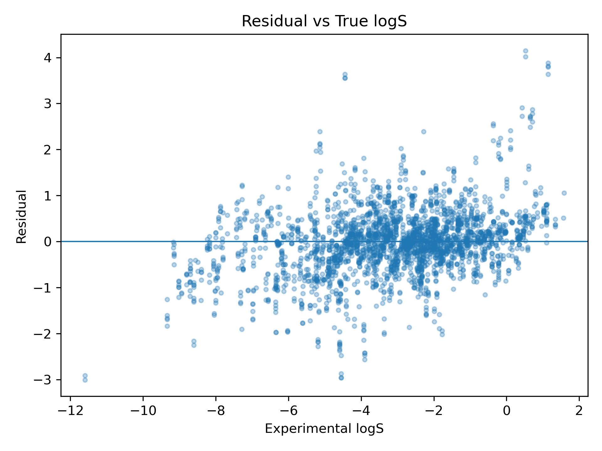
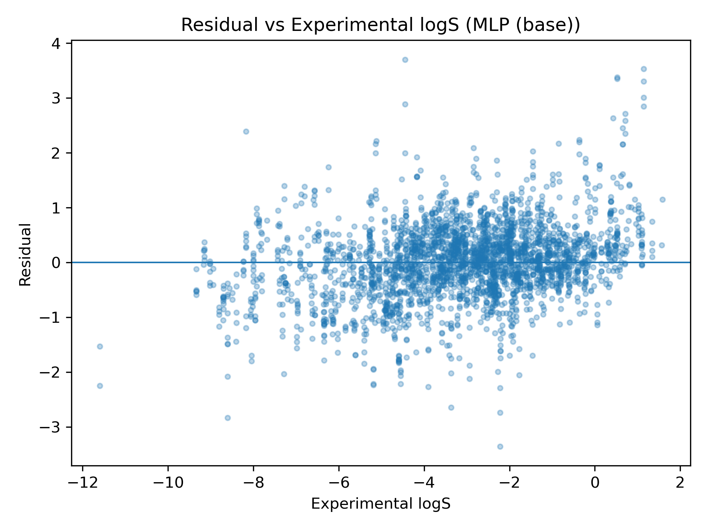
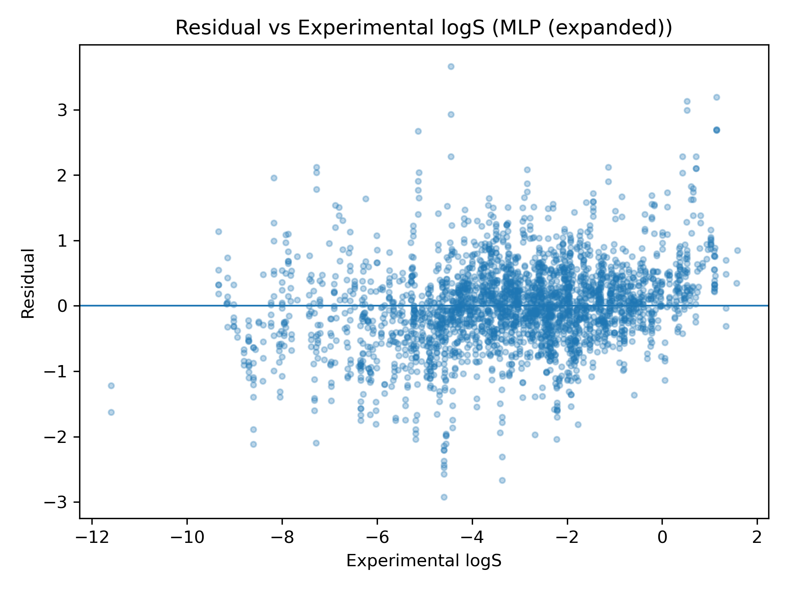

# RF vs Base MLP vs Expanded MLP Error Analysis

## Model Performance

The expanded MLP shows notable performance improvements over the base MLP and tuned RF, evidenced by both a lower mean RMSE and standard deviation. This suggests that the reimplementation of the expanded descriptor-set provided some extra signal that both improved generalization (lower RMSE) and performed more stably across seeds (lower std).

## Residuals

All three residual curves are approximately centered around 0, indicating low overall bias across the three models. The degree of overlap is high, but shorter tails and stronger clustering around 0 for the expanded MLP model indicates it as particularly strong, as corroborated by previous findings.

### Random Forest

The RF residuals are centered near zero, but the scatter shows noticeable widening at the extremes of experimental logS, indicating reduced accuracy for very insoluble or very soluble compounds. The presence of several large outliers suggests that, while the RF performs adequately on average, it can produce substantial errors on edge cases.

### Base MLP
)

Residuals are also centered near 0 across most of the logS range, suggesting no notable bias, but the spread increases toward the extremes, indicating larger errors on edge cases (much like the RF model, but at a lower scale).

### Expanded MLP

Residuals remain also centered near 0 and most points cluster relatively tightly around the zero line in the mid-range of logS. As with the base model, error magnitude grows at the extremes, and a small number of high-magnitude outliers remain.

## Training & Validation Curves for MLPs

### Base

Train and validation MSE drop very steeply in the first few epochs, then decrease more gradually and largely plateau by ~20–30 epochs, indicating that additional training would not behoove this model. The validation curve stays slightly above the training curve throughout, indicating a small generalization gap (very minor overfitting).

The expanded MLP shows the same overall training dynamics: rapid early improvement followed by a slower plateau. A slightly larger train–validation gap is present, but this pattern is still only consistent with minor overfitting.

## Next Steps

- MLP permutation and feature importance -- how do MLP and RF prediction criteria compare and contrast?