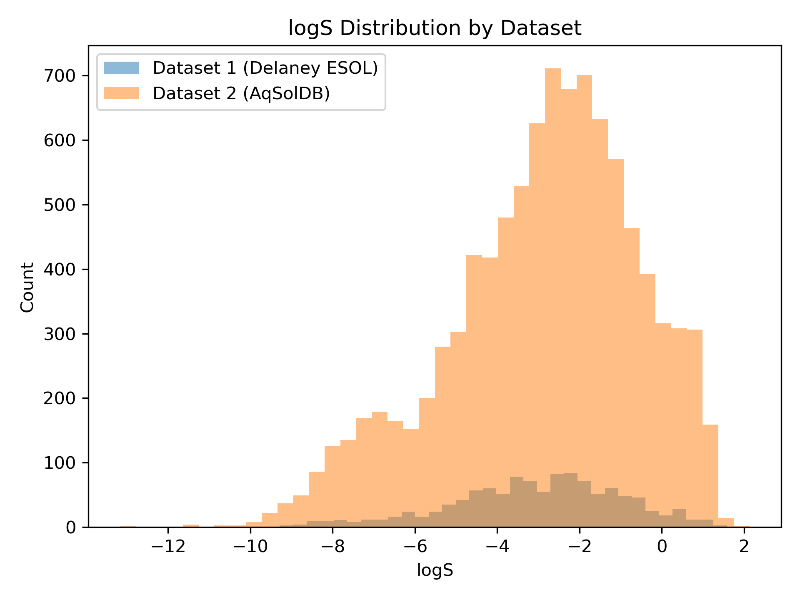
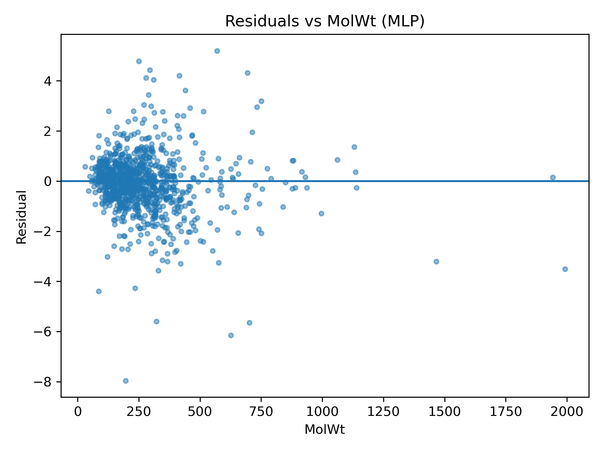
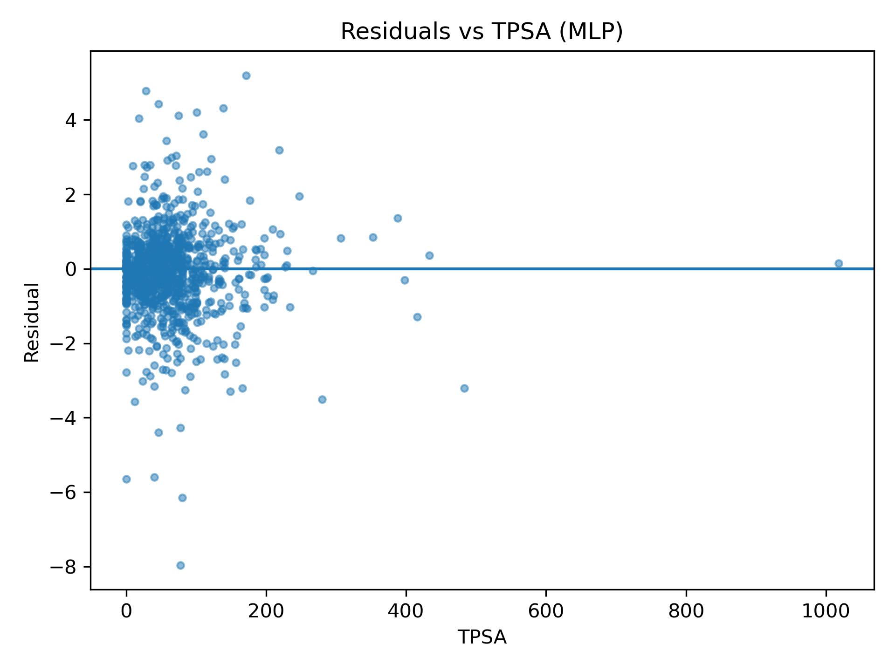
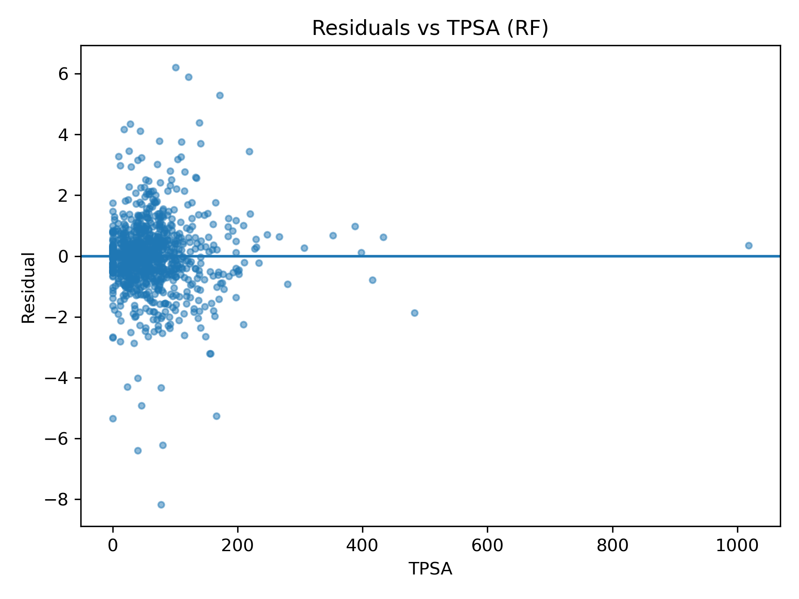
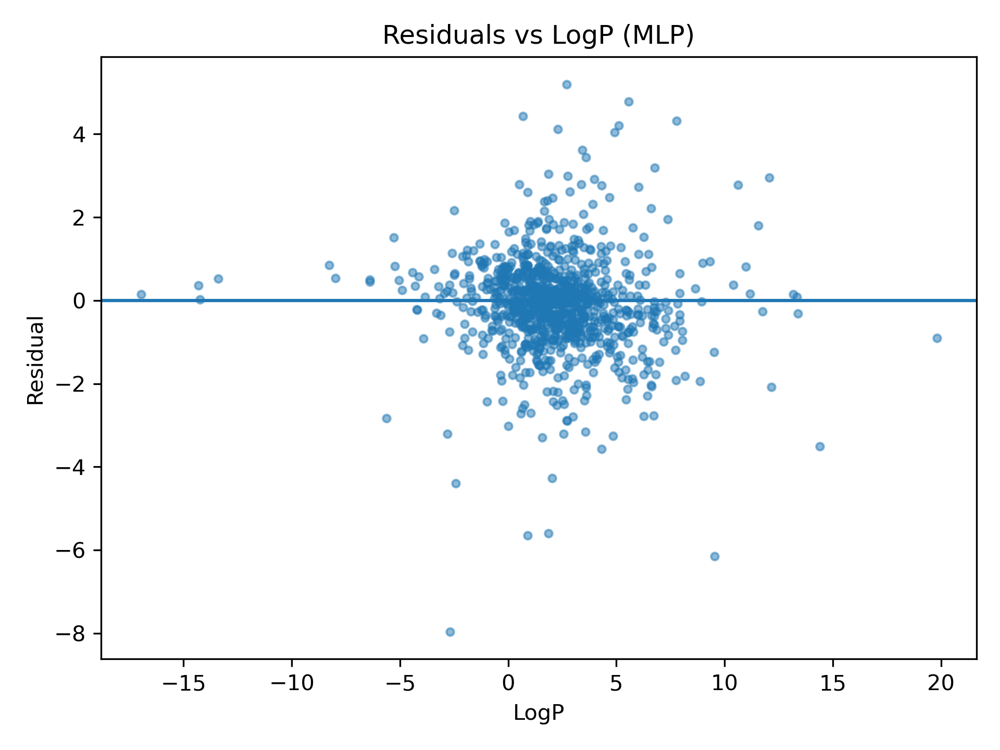
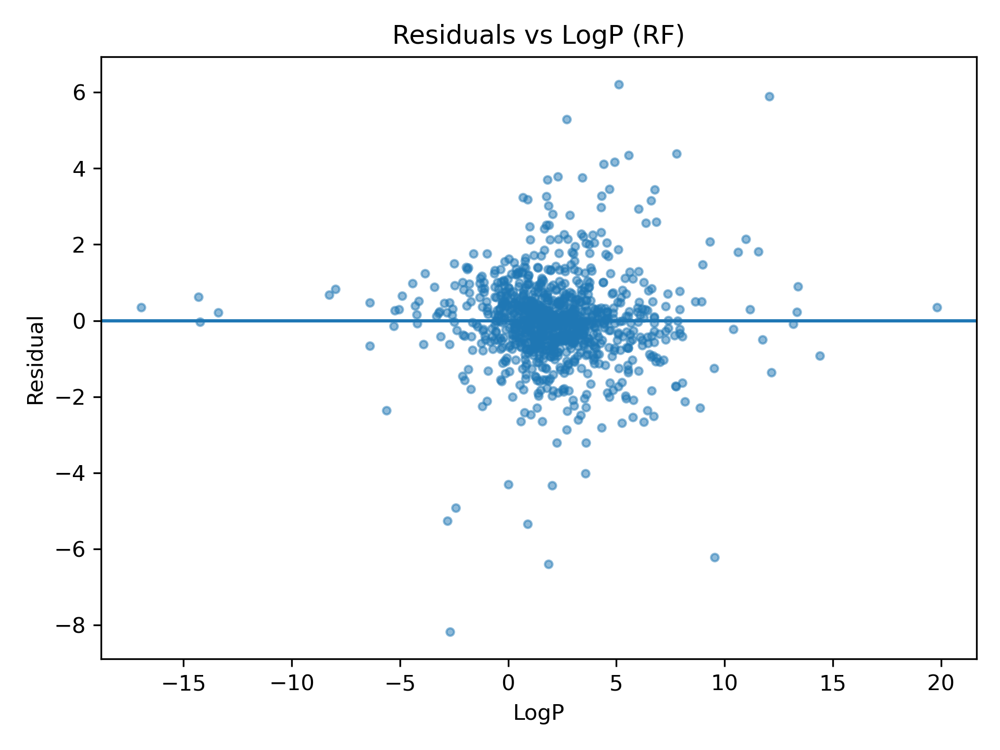

# Re-Train on AqSolDB

[**AqSolDB Kaggle Download**](https://www.kaggle.com/datasets/sorkun/aqsoldb-a-curated-aqueous-solubility-dataset?resource=download)

The AqSolDB dataset differs substantially from the Delaney ESOL baseline. The cleaned dataset (removed unparseable SMILES, recomputed molecular descriptors) contains 9655 organic molecules with logS values spanning `-13.17` to `2.14`. These differences are reflected in the test set's metrics, including RMSE, residual distribution, and R². 

## Method

Recreated the same split and RF/MLP models as in previous steps, completely using the AqSolDB dataset. logS was identified as the target variable, and descriptors were calculated for each molecule and model correspondingly. The models were trained separately, with both using a 80/10/10 train/validation/test split. The MLP includes a standard sklearn.preprocessing module scaler fitted on the train split from AqSolDB, and uses an Adam optimizer with an MSE loss function. Both models use **ESOL-tuned** hyperparameters as previously determined and documented.

## Summary

`test_rmse_mlp = 1.168`

`test_rmse_rf = 1.208`

For context, compared to ESOL mean RMSE across 25 seeds (RF = 0.705, MLP = 0.648), the single-seed AqSolDB test RMSE is 1.71x and 1.80x higher, respectively. A rigorous comparison would require repeating AqSolDB evaluation across seeds. Although this simplified version only tests one random seed, it works as a basic diagnostic for where the models succeed and fail with new data.

External performance declines primarily due to domain shift in molecules tested: AqSolDB contains many large and complex molecules with a more extreme solubility distribution, whereas ESOL primarily contains smaller, drug-like molecules that are primarily soluble to moderately insoluble. This domain shift had substantial effects on the models' abilities to generalize.

- Bin-stratified metrics indicate size & complexity dependent error growth (e.g. MLP RMSE rises from 0.98 at ≤20 heavy atoms to 2.08 at 40–60)
- Both RF and MLP struggle in the very low-solubility tail (e.g. RMSE = 2.36 for logS in (-10, -8]), implying that chemistry with these extreme cases is just more difficult to predict
- Residual vs descriptor analysis corroborates that the greatest failures are in extrapolating beyond the domain of the Delaney ESOL
- For the model to generalize better across AqSolDB's domain, additional, richer (fingerprints e.g. Morgan) descriptors, and a wider range of training-set molecules would likely be advantageous 

## Error Increases with Molecular Size & Complexity

Stratifying by HeavyAtomCount and BertzCT shows a clear decline in MLP performance:

### MLP vs HeavyAtomCount
- ≤20: RMSE 0.98, R² 0.80 (n=706)
- 20–40: RMSE 1.48, R² 0.52 (n=216)
- 40–60: RMSE 2.08, R² 0.44 (n=33)

### MLP vs BertzCT
- 0–500: RMSE 1.05, R² 0.71 (n=612)
- 500–1000: RMSE 1.17, R² 0.72 (n=267)
- 1000–1500: RMSE 1.94, R² 0.33 (n=53)

### RF vs BertzCT
- 0-500: RMSE 1.07, R² 0.70 (n=612)
- 500-1000: RMSE 1.20, R² 0.71 (n=267)
- 1000-1500: RMSE 2.11, R² 0.21 (n=53)

The takeaway is not the exact bins, but the trend: as molecules become larger and more complex, both models lose predictive stability. This is consistent with the claim that the model fails to generalize beyond the ESOL domain. Large-molecule and high complexity bins are sparser, with low n-values making estimates more difficult and noisier in those regions.

## Breakdown in Low-Solubility Distribution Tail

Binning by true logS value shows very large errors in the low-solubility tail for both models:

- (-8, -6]: RMSE ≈ 1.68 (MLP/RF), n=87
- (-10, -8]: RMSE ≈ 2.36 (MLP/RF), n=28

These solubilities are sparsely represented in the ESOL training distribution (see above histogram), and errors expand greatly in this tail.

The very low logS tail likely reflects a combination of (i) different chemistry relative to the ESOL training domain and (ii) greater variance in compiled experimental databases (e.g. differing experimental conditions or measurement protocols), both of which can increase error in the extreme tail.

## Residual Plot Diagnostics

Across the residual plots (shown in `wk6/dataset_figures`), the dominant pattern is:

- Dense central regions (typical drug-like ranges) show residuals roughly centered near 0 with moderate spread
- Sparse extremes show larger and more scattered residuals (high leverage points)

Specific signals from representative plots:

### MolWt

AqSolDB includes rare very high-molecular-weight compounds (approaching 2000 Da), and these high-leverage points are associated with much larger residual magnitudes.

### TPSA

Also heavy-tailed; rare points with very high TPSA and correspondingly high residuals. Errors appear more variable where data points are sparse, suggesting limited training coverage in highly polar molecules.

### logP

Residuals remain roughly centered in the mid-range, but tails include scattered large errors, again pointing to extrapolation error over descriptor bias.

Overall, these plots do not suggest a single descriptor is wrong. Instead, they indicate that most failures are a result of poor extrapolation in sparsely populated regions (namely, very large or complex molecules and extreme tail logS values) where the ESOL-based models have limited training coverage and residual variance increases greatly. 

## Where is the Model Most Useful?

Given the AqSolDB results, the RF/MLP models are most reliable when applied to molecules similar to the Delaney ESOL domain. This includes small-to-moderate sized, organic molecules where the descriptor ranges overlap the training distribution.

Recommended operating domain: lower size/complexity regime, where both error and fit quality are substantially better.

- HeavyAtomCount ≤ 20: MLP RMSE ≈ 0.98, R² ≈ 0.80 (n=706)
- BertzCT ≤ 1000: MLP RMSE ≈ 1.05–1.17, R² ≈ 0.71–0.72 (n=879 combined)

In practice, this corresponds to typical small molecules (often similar to drug-like scale), and avoids the high-leverage regions where performance degrades (HeavyAtomCount > 40 for MLP; very high BertzCT; very low logS). Practically, this means the model is well-suited for screening of ESOL-like small molecules, a common application for chemical engineering workflows or applications in pharmaceutical R&D.

## Next Steps
- Assess Delaney ESOL performance on AqSolDB training; vice-versa
    - Output: 2x2 matrix with training set, test set, and RMSE
- (Optional, if results are compelling) inspect permutation importance for each combination
- Finalize visualizations and writeups